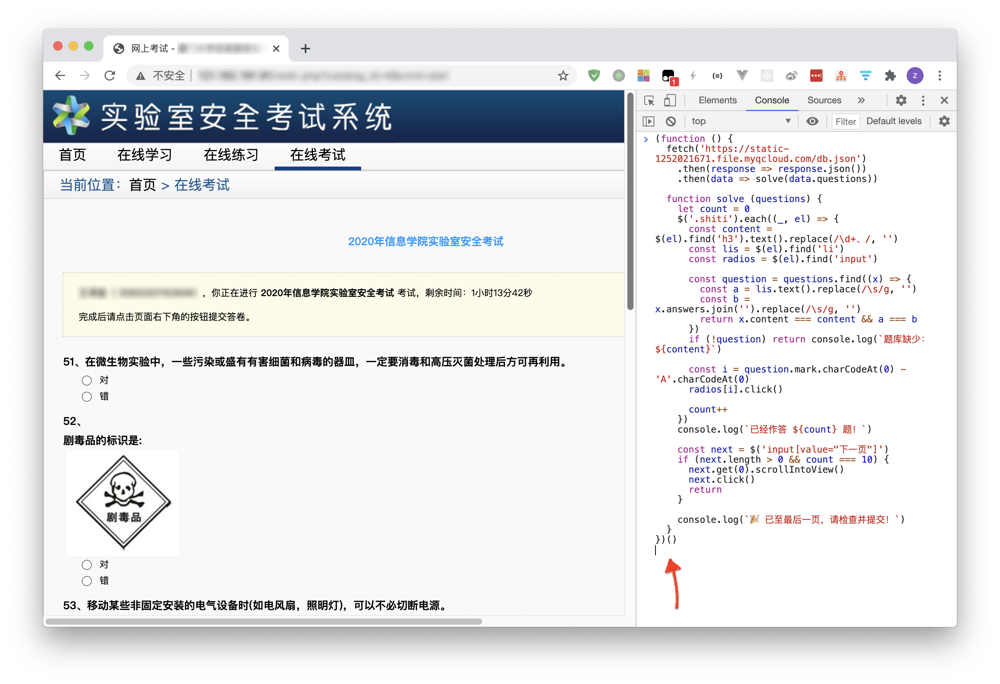

## 实验室安全考试辅助脚本

> “挺好的，但炼丹学院实验室看起来并没有这些化学品、细菌孢子和数控车床…🤔”

## 本题库已收录

- 2020年信息学院实验室安全考试

## 使用说明

1. 复制 `main.js` 内全部代码
2. 打开 `安全考试` 答题页面
3. 按下 `F12` 打开开发者窗口
4. 找到 `Console` 面板
5. 按下 `ctrl+v` 贴入代码
6. 按下 `回车`
7. 反复进行，直到完成每一页

建议适当放慢答题时间、适度控制考试分数。



## 如何制作题库

首先需在 `.env` 中填入 `COOKIES` 环境变量。
然后使用 `index.js` 反复进行 `模拟考试` 抓取尽可能多的题目进入 `db.json`。

```shell
$ cd src # 进入 src 目录
$ npm install # 安装依赖
$ npm start # 启动抓取与生成
```

## 协议

MIT